# Tutorial Spring Boot com API CRUD de Tutoriais

Este projeto consiste em uma API em Spring Boot que realiza operações CRUD (Create, Read, Update, Delete) de tutoriais. Ele fornece endpoints para gerenciar tutoriais, incluindo criação, atualização, exclusão e consulta.

## Ambiente de Desenvolvimento

#### Diagrama Java Spring Boot Hibernate JPA
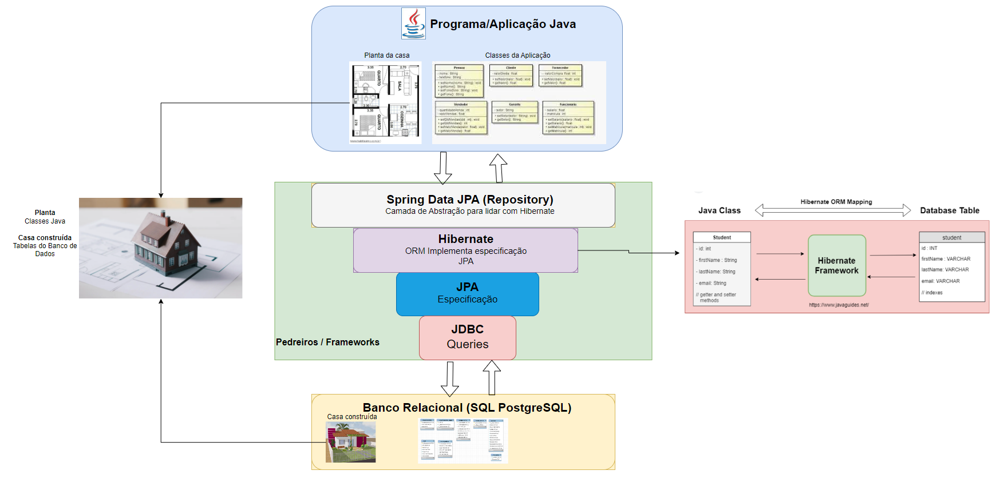

#### Diagrama Spring Boot e Angular
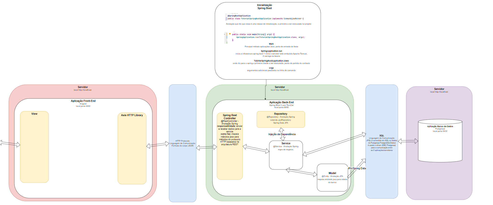

## ControllerAdvise e Exception Java

#### Uso no projeto do ControllerAdvise para capturar as Excessões do TutorialController
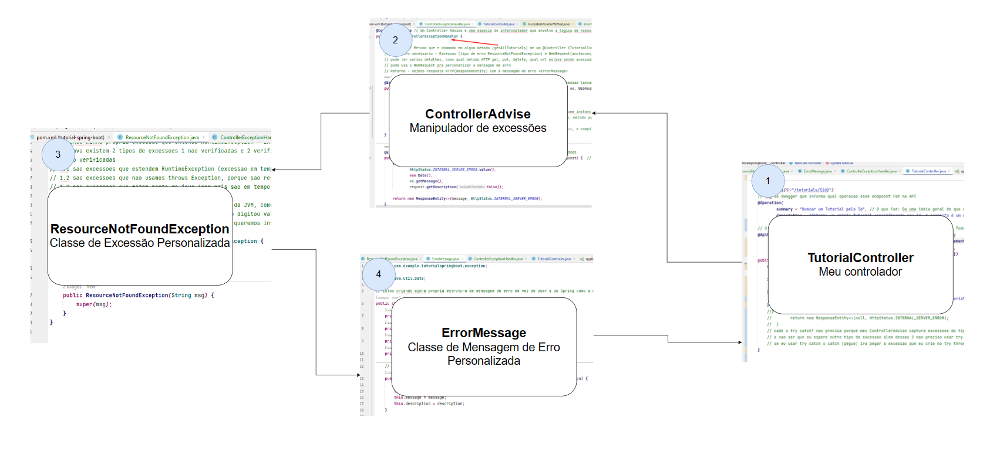

#### Explicação das Excessões em Java (1 Checada 2 Não Checada)
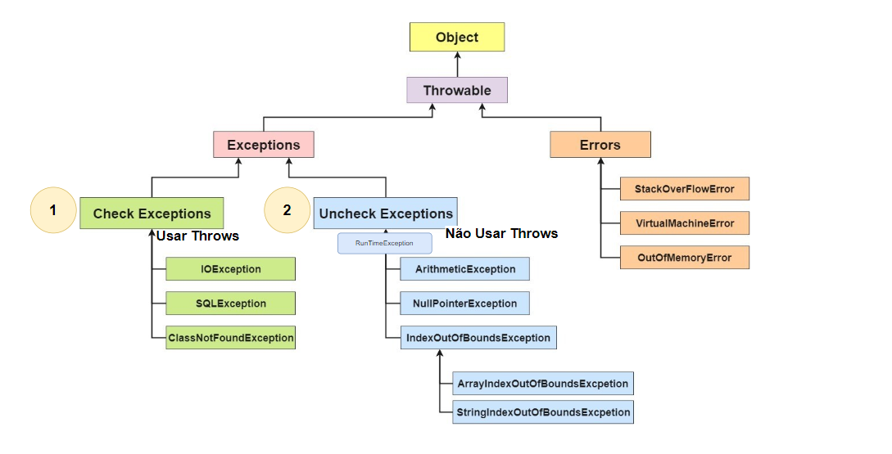

#### Insomnia Excessão
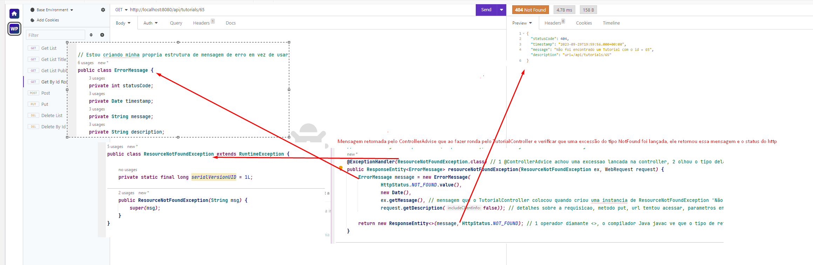

## Paginação e Classificação Spring (Page e Pageable)

#### Uso no projeto do Page e Pageable para fazer paginação e classificação dos dados
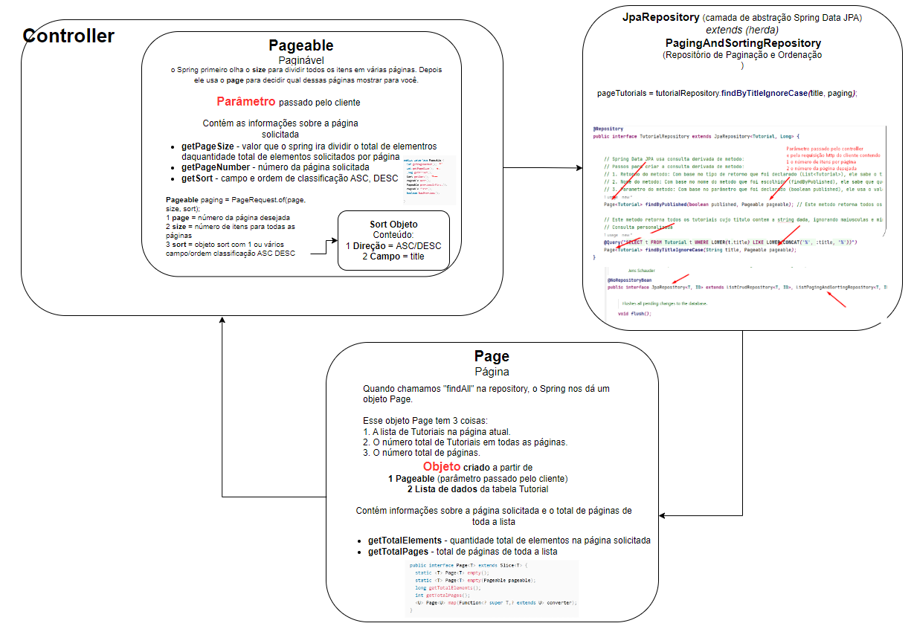

#### Insomnia getAllTutorials com parâmetro título, paginação e classificação
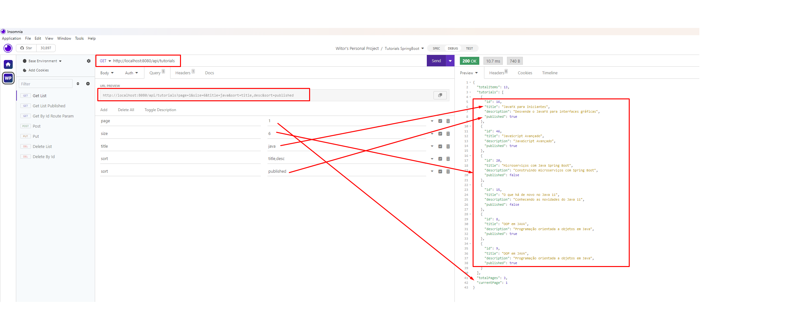

## JUnit Teste Unitário

#### Diagrama JUnit
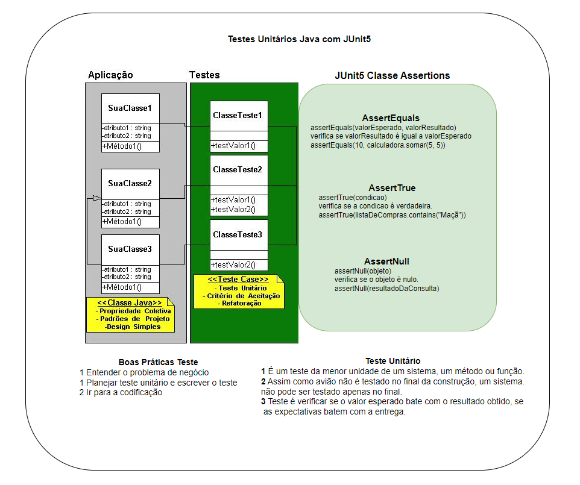

## Documentação da API

A documentação da API é gerada automaticamente com o Swagger e pode ser acessada em:
```bash
http://localhost:8080/swagger-ui.html
```
ou
```bash
http://localhost:8080/witorsather-documentation
```

### Swagger OpenAPI

#### Inicialização Swagger (Init)
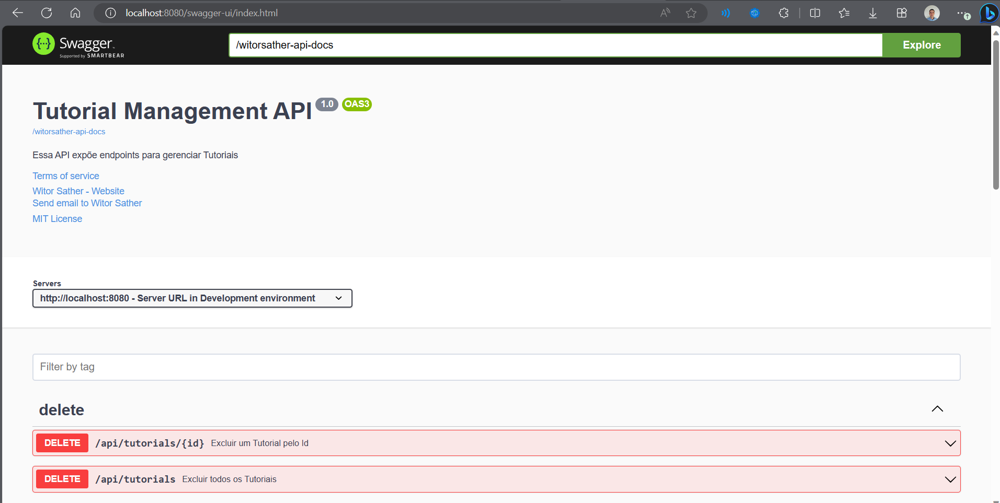

#### Solicitação de Tutoriais por ID (Get ID Request)
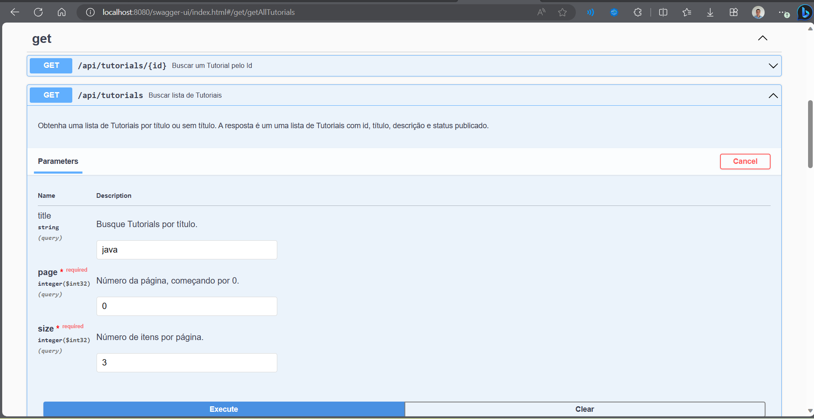

#### Resposta da Solicitação de Tutoriais por ID (Get Response)
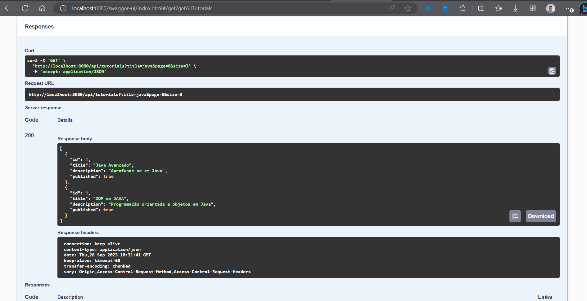

## Endpoints da API

A API oferece os seguintes endpoints para gerenciar tutoriais:

- `POST /tutorials`: Cria um novo tutorial.
- `GET /tutorials`: Lista todos os tutoriais.
- `GET /tutorials/{id}`: Obtém um tutorial por ID.
- `PUT /tutorials/{id}`: Atualiza um tutorial por ID.
- `DELETE /tutorials/{id}`: Exclui um tutorial por ID.

## Requisitos

Antes de começar, certifique-se de que você tenha os seguintes requisitos instalados:

- Java Development Kit (JDK)
- Spring Boot
- PostgreSQL (ou outro banco de dados de sua escolha)

## Configuração do Banco de Dados

Certifique-se de configurar corretamente o banco de dados em seu arquivo `application.properties`. Por padrão, o projeto está configurado para usar o PostgreSQL. Certifique-se de definir as configurações apropriadas para o seu banco de dados.

```properties
spring.datasource.url=jdbc:postgresql://localhost:5432/seu_banco_de_dados
spring.datasource.username=seu_usuario
spring.datasource.password=sua_senha    
```

## Como Executar o Projeto

Siga estas etapas para executar o projeto em sua máquina:

1. **Clonar o Repositório**
   - Para clonar o repositório para sua máquina local, abra o terminal e execute o seguinte comando:
    ```bash
    git clone https://github.com/seu-usuario/nome-do-repo.git
    ```

2. **Navegar até o Diretório do Projeto**
   - Após clonar o repositório, navegue até o diretório do projeto usando o comando:
    ```bash
    cd nome-do-repo
    ```

3. **Iniciar a Aplicação Spring Boot**
   - Para iniciar a aplicação Spring Boot, execute o seguinte comando:
    ```bash
    ./mvnw spring-boot:run
    ```
   Isso iniciará o servidor da aplicação na porta padrão 8080. Certifique-se de que a porta esteja disponível.

4. **Acessar a API**
   - Para acessar a API localmente, abra o navegador e acesse:
    ```bash
    http://localhost:8080/api
    ```

## Testando a API

Você pode usar ferramentas como o Postman ou o Insomnia para testar os endpoints da API. Basta fazer solicitações HTTP (pedidos para a internet) para os endpoints acima para realizar as operações CRUD (Criar, Ler, Atualizar, Deletar).


